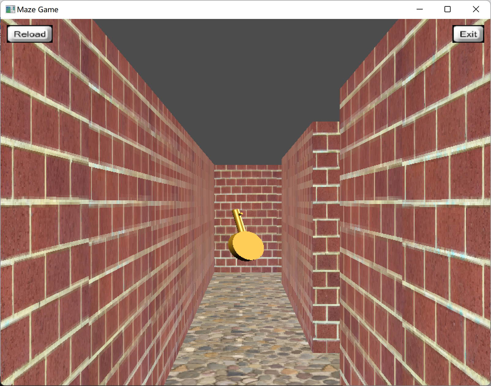

# OpenGL-MazeGame

A ~~crude~~ maze game using opengl/freeglut(including camera contrallor with keyboard and mouse, basic models, materials, textures and so on) for CG course.


## Install

### Requirement

Git
Make
[freeglut](http://freeglut.sourceforge.net/)

I have built in Windows successfully.

### Build

```bash
git clone git@github.com:pisceskkk/OpenGL-MazeGame.git
cd OpenGL-MazeGame
make
```

## Play

## Start

Run the command in the **root directory**.

```bash
make run
```

### Key Bindings

| Key | Feature |
|:---:|:---:|
| `W` | Go Forward |
| `S` | Go Backward |
| `A` | Turn Left |
| `D` | Turn Right |
| `R` | Reload Game |
| `E` | Open Door(if you have enough keys) |
| `F` | Fetch Keys or Stars |
| `Esc` | Exit Game |

### Maze Generator

Just change `assets\maze.txt` and rerun the game.

#### Content of `maze.txt`

```
H W
###...###
...
...
###...###
```

The first line is the size of maze.
Then there are `H` lines describing the whole maze, and each line has `W` characters whose meanings are as followed table.

| Character | Object |
| :---: | :---: |
| `#` | Wall |
| `Space` | Empty |
| `|` | Vertical Door |
| `-` | Horizontal Door|
| `k` | Key |
| `s` | Start Point |
| `e` | Star(End Point) |

## Screenshot

